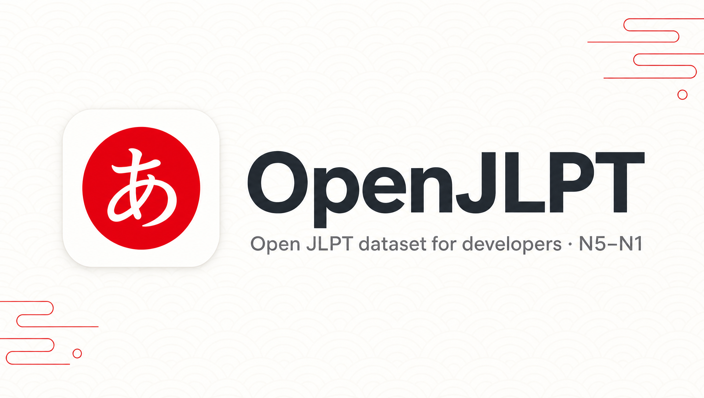

<div align="center">



# OpenJLPT

**The open, correctly-licensed JLPT dataset for developers.**

Every JLPT vocabulary word and kanji, N5 → N1 — as clean **JSON**, **CSV**, and a prebuilt
**SQLite** database. Properly sourced, fully attributed, and easy to drop into any
flashcard, quiz, or language-learning app.

[](./LICENSE)
[](#whats-inside)
[](#whats-inside)
[](#whats-inside)
[](.github/workflows/ci.yml)
[](https://pypi.org/project/openjlpt/)

</div>

---

## Why OpenJLPT?

Building a Japanese-learning app means stitching together half a dozen half-maintained
repos, then discovering none of them agree on levels, most have no example data, and the
licensing is a mystery. OpenJLPT fixes that:

- ✅ **Complete** — vocabulary **and** kanji for every level, N5 through N1.
- ✅ **Example sentences** — real Japanese↔English sentence pairs (Tatoeba) on 89% of words.
- ✅ **One canonical schema** — [documented](./schema), versioned, validated in CI.
- ✅ **Three formats** — JSON (per level), CSV (spreadsheet-friendly), and a prebuilt,
  indexed **SQLite** database for real queries.
- ✅ **Honestly licensed** — CC BY-SA 4.0 with a full [`NOTICE`](./NOTICE.md). We tell you
  exactly where every field comes from.
- ✅ **Reproducible** — one command rebuilds the whole dataset from upstream sources.

### How it compares

| Repo | Vocab | Kanji | Examples | Grammar | SQLite | Clear license | Maintained |
|---|:---:|:---:|:---:|:---:|:---:|:---:|:---:|
| Typical vocab list repo | ✅ | ❌ | ❌ | ❌ | ❌ | ⚠️ | ❌ |
| Typical kanji-data repo | ❌ | ✅ | ❌ | ❌ | ❌ | ⚠️ | ⚠️ |
| **OpenJLPT** | ✅ | ✅ | ✅ | 🔜 | ✅ | ✅ | ✅ |

## Who is this for?

New here and not a programmer? In plain terms: the JLPT is the official Japanese exam, with
five levels (N5 = beginner → N1 = advanced). To study, you need to know **which words and
kanji belong to each level**. OpenJLPT is a clean, complete, free **master list** of all of
them — with real example sentences — ready to drop into any app or study tool. Think
pre-washed, pre-chopped ingredients instead of digging them out of the dirt yourself.

- 🛠️ **App & tool makers** — building a flashcard app, quiz game, or study bot? Skip weeks of
  tedious data-gathering and go straight to building the fun part.
- 👩‍🏫 **Teachers** — pull ready-made word and kanji lists for worksheets and lesson materials.
- 🎓 **Learners & self-studiers** — grab the exact "what do I need for N4?" lists, with examples.
- 🔬 **Researchers & tinkerers** — a clean, well-documented dataset to build and experiment on.

Not sure how to use the files? Start with the [Quick start](#quick-start) below — you can grab
the data with **no coding at all**.

## What's inside

| Level | Vocabulary | Kanji |
|:---:|:---:|:---:|
| N5 | 662 | 79 |
| N4 | 632 | 166 |
| N3 | 1,784 | 367 |
| N2 | 1,793 | 367 |
| N1 | 3,463 | 1,232 |
| **Total** | **8,334** | **2,211** |

```
data/
├── json/
│   ├── vocab/{n5,n4,n3,n2,n1}.json
│   └── kanji/{n5,n4,n3,n2,n1}.json
├── csv/
│   ├── vocab-n5.csv … vocab-n1.csv
│   └── kanji-n5.csv … kanji-n1.csv
└── openjlpt.sqlite          # tables: vocab, kanji (indexed by level, word, character)
```

## Quick start

### Just the data (no install)

Grab the JSON or CSV straight from `data/`. Each vocabulary entry — with example sentences where available (89% of words):

```json
{
  "word": "食べる", "reading": "たべる", "meanings": ["to eat"], "level": "N5",
  "examples": [
    { "ja": "魚を食べる。", "en": "I eat fish." }
  ]
}
```

Each kanji entry:

```json
{
  "character": "日", "level": "N5", "strokes": 4, "grade": 1, "freq": 1,
  "onyomi": ["ニチ", "ジツ"], "kunyomi": ["ひ", "-び", "-か"],
  "meanings": ["day", "sun", "Japan", "counter for days"]
}
```

### npm (TypeScript loader)

```bash
npm install openjlpt
```

```ts
import { getVocab, findKanji, searchVocab } from 'openjlpt';

getVocab('N5');            // → all 662 N5 words, fully typed
findKanji('日');           // → { level: 'N5', strokes: 4, onyomi: ['ニチ','ジツ'], ... }
searchVocab('eat', 'N5');  // → [{ word: '食べる', reading: 'たべる', ... }]
```

### Python (PyPI loader)

```bash
pip install openjlpt
```

```python
from openjlpt import get_vocab, find_kanji, search_vocab, query

get_vocab("N5")               # → all 662 N5 words, typed dataclasses
find_kanji("日")              # → Kanji(character='日', level='N5', strokes=4, ...)
search_vocab("eat", "N5")     # → [Vocab(word='食べる', reading='たべる', ...)]

# Prebuilt SQLite database is bundled, ready for analysis:
query("SELECT word, reading FROM vocab WHERE level = 'N5' LIMIT 5")
```

### SQLite

```sql
-- All N3 kanji, most frequent first
SELECT character, strokes, meanings FROM kanji WHERE level = 'N3' ORDER BY freq;

-- Look up a word
SELECT word, reading, meanings FROM vocab WHERE word = '食べる';
```

## Where the data comes from

JLPT never publishes official word/kanji lists, so **level assignments** come from
[Jonathan Waller's community-standard lists](https://www.tanos.co.uk/jlpt/) (CC BY), and
kanji details are enriched from [KANJIDIC2](https://www.edrdg.org/wiki/KANJIDIC_Project.html)
(EDRDG, CC BY-SA 4.0). Full details and caveats are in [`NOTICE.md`](./NOTICE.md).

## Rebuild from source

```bash
npm install
npm run build        # fetch upstream → build JSON/CSV/SQLite → validate
```

Individual steps: `npm run fetch`, `npm run build:data`, `npm run validate`.

## Roadmap

- [x] N5–N1 vocabulary (JSON + CSV + SQLite)
- [x] N5–N1 kanji enriched from KANJIDIC2
- [x] Canonical JSON Schema + CI validation
- [x] Example sentences per word (Tatoeba)
- [ ] Structured grammar points per level
- [ ] Audio (native / TTS)
- [x] Python package on PyPI
- [ ] Hosted REST / GraphQL API

## Contributing

Corrections and additions are very welcome — see [`CONTRIBUTING.md`](./CONTRIBUTING.md).

## 💛 Support

OpenJLPT is free and open. If it saves you time, please consider
[sponsoring](https://github.com/sponsors) — it funds the ongoing data updates that keep the
dataset current and correct. A ⭐ helps too!

## License

- **Dataset & code:** [CC BY-SA 4.0](./LICENSE) — free to use, including commercially, with
  attribution and share-alike. See [`NOTICE.md`](./NOTICE.md) for source attribution.

## Related resources

A small curated hub for building Japanese-learning tools:

- [JMdict / EDICT & KANJIDIC2 (EDRDG)](https://www.edrdg.org/) — the foundational dictionaries
- [Jonathan Waller's JLPT Resources](https://www.tanos.co.uk/jlpt/) — JLPT lists & study material
- [Tatoeba](https://tatoeba.org) — CC-licensed example sentences
- [Yomitan](https://github.com/yomidevs/yomitan) — browser pop-up dictionary
- [Anki](https://apps.ankiweb.net/) — spaced-repetition flashcards
