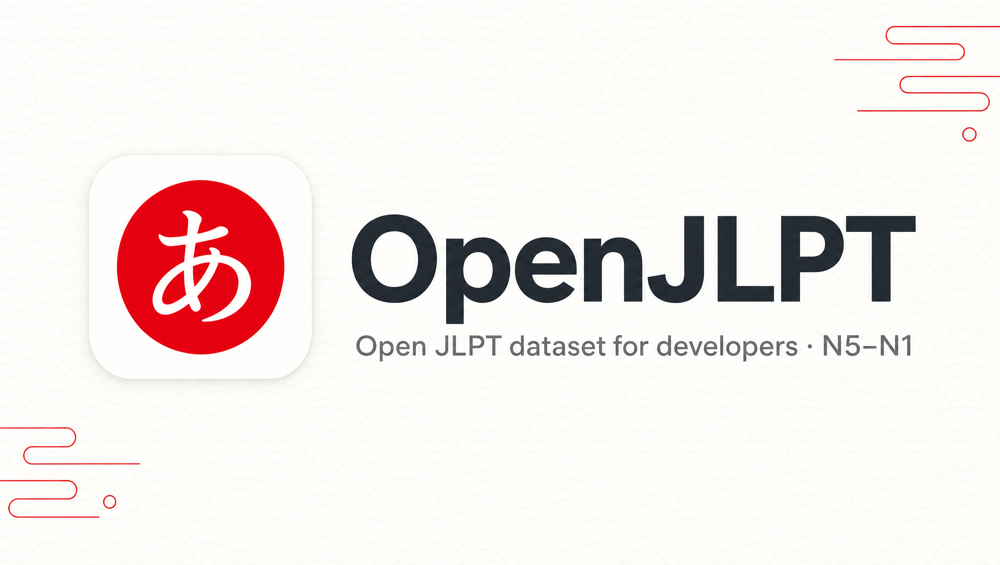

<div align="center">



# OpenJLPT

**Every JLPT word, kanji and grammar point, N5 → N1. Free, open, and clean.**

7,868 words · 2,211 kanji · 526 grammar points · example sentences for 95% of words<br>
as **JSON**, **CSV**, **SQLite**, **Anki decks**, a **Yomitan** dictionary, and typed **npm** / **PyPI** packages.

[](https://github.com/evanclan/OpenJLPT/actions/workflows/ci.yml)
[](https://www.npmjs.com/package/openjlpt)
[](https://pypi.org/project/openjlpt/)
[](./LICENSE)
[](#whats-inside)
[](https://github.com/evanclan/OpenJLPT/stargazers)

**[🌐 Website](https://evanclan.github.io/OpenJLPT/)** ·
**[🃏 Anki decks](https://evanclan.github.io/OpenJLPT/data.html#anki)** ·
**[📦 Download](#-download)** ·
**[⚡ Quick start](#-quick-start)** ·
**[📖 Data format](#-data-format)** ·
**[日本語](./README.ja.md)**

</div>

---

## Why OpenJLPT?

Building a Japanese-learning app usually means stitching together half-maintained repos,
then discovering they disagree on levels, have garbled readings, no example sentences, and
unclear licensing. OpenJLPT fixes that:

- ✅ **Complete.** Vocabulary, kanji **and** grammar for every level, N5 through N1.
- ✅ **Clean.** Every word is matched to its [JMdict](https://www.edrdg.org/jmdict/j_jmdict.html) entry (99.7%) for part of speech and a dictionary ID, and readings are verified. Hundreds of source errors are fixed ([see how](#-how-the-data-is-built)).
- ✅ **Real example sentences.** Tatoeba sentences for 95% of words, matched by *dictionary form*, so 読む finds 読んでいる. Curated, level-appropriate sentences come first.
- ✅ **526 grammar points.** Original, reviewed explanations with formation rules, 2–3 examples each, and notes on easily confused patterns.
- ✅ **Ready to use anywhere.** JSON, CSV, SQLite (with full-text search), Anki, Yomitan, npm, PyPI, a CLI, and a CDN.
- ✅ **Stable IDs.** Key your users' progress to an `id` that survives dataset updates.
- ✅ **Honestly licensed.** CC BY-SA 4.0, with a [NOTICE](./NOTICE.md) that says where every field comes from.
- ✅ **Kept fresh.** A monthly job rebuilds everything from upstream sources, and CI validates every entry against [JSON Schemas](./schema).

## Who is this for?

The JLPT is the official Japanese proficiency exam, with five levels from **N5** (beginner)
to **N1** (advanced). To study for it you need to know *which* words, kanji and grammar belong
to each level. OpenJLPT is a clean, complete, free master list of all of them.

- 🎓 **Learners.** [Browse every level](https://evanclan.github.io/OpenJLPT/), study with the built-in [flashcards](https://evanclan.github.io/OpenJLPT/flashcards.html), or import the [Anki decks](https://evanclan.github.io/OpenJLPT/data.html#anki). No coding needed.
- 🛠️ **App & tool makers.** Building a flashcard app, quiz game, Discord bot or reader? Skip weeks of data wrangling.
- 👩‍🏫 **Teachers.** Pull word and kanji lists by level for worksheets and lesson plans (CSV opens in Excel and Google Sheets).
- 🔬 **Researchers.** A documented, reproducible dataset with provenance for every field.

## 📊 What's inside

| Level | Vocabulary | Kanji | Grammar | Description |
|:---:|---:|---:|---:|---|
| **N5** | 661 | 79 | 81 | Beginner — basic phrases and the first ~100 kanji |
| **N4** | 630 | 166 | 98 | Elementary — everyday conversation |
| **N3** | 1,660 | 367 | 101 | Intermediate — the bridge to real-world Japanese |
| **N2** | 1,790 | 367 | 123 | Upper intermediate — news, business |
| **N1** | 3,127 | 1,232 | 123 | Advanced — abstract and literary Japanese |
| **Total** | **7,868** | **2,211** | **526** | |

Each word appears once, at the easiest level that lists it. Counts come from
[`data/json/meta.json`](./data/json/meta.json), which also records the upstream versions used.

## ⚡ Quick start

### No code: website, Anki, Yomitan

- **[evanclan.github.io/OpenJLPT](https://evanclan.github.io/OpenJLPT/)** has a page for every word, kanji and grammar point,
  plus search, flashcards, and a *"what JLPT level is this text?"* analyzer.
- **[Anki decks](https://evanclan.github.io/OpenJLPT/data.html#anki)** for each level, with furigana, example sentences and text-to-speech.
- **[Yomitan dictionary](https://evanclan.github.io/OpenJLPT/data.html#yomitan)** that shows JLPT levels in your pop-up dictionary.

### From a browser or any language: CDN

Every file is served by jsDelivr. No install, no API key:

```js
const n5 = await fetch('https://cdn.jsdelivr.net/gh/evanclan/OpenJLPT@main/data/json/vocab/n5.json').then((r) => r.json());
```

### JavaScript / TypeScript

```bash
npm install openjlpt
```

```ts
import { getVocab, findWord, findKanji, searchVocab, getGrammar, kanjiIn } from 'openjlpt';

getVocab('N5');                // 661 words, fully typed
findWord('食べる');             // { reading: 'たべる', romaji: 'taberu', pos: ['v1', 'vt'], examples: [...] }
findKanji('日');                // { strokes: 4, radical: '日', onyomi: ['ニチ','ジツ'], words: ['明日', ...] }
searchVocab('taberu');          // kanji, kana, romaji or English; ranked
getGrammar('N4');               // 98 grammar points with examples
kanjiIn('日本語を勉強する').map((k) => k.level);   // ['N5', 'N5', 'N5', 'N4', 'N4']
```

### Python

```bash
pip install openjlpt
```

```python
from openjlpt import find_word, search_vocab, get_grammar, query

find_word("食べる").meanings                  # ['to eat']
search_vocab("weather", level="N5")[0].word  # '天気'
len(get_grammar("N3"))                       # 101

# The SQLite database is bundled, with an FTS5 full-text index:
query("SELECT word, reading FROM vocab WHERE level = 'N5' LIMIT 5")
```

### Command line

```console
$ npx openjlpt 食べる          # or: pip install openjlpt && openjlpt 食べる
[N5] 食べる たべる taberu
   to eat
   Ichidan verb, transitive verb
   › ちょうど食べたかったものでした。
     That hit the spot.

$ npx openjlpt kanji 日        # kanji details
$ npx openjlpt grammar ながら   # grammar points
$ npx openjlpt quiz N4         # 10-word reading quiz in your terminal
```

### SQLite

```sql
-- All N3 kanji, most frequent first
SELECT character, strokes, meanings FROM kanji WHERE level = 'N3' ORDER BY freq;

-- Full-text search over words, readings, romaji and meanings
SELECT v.word, v.reading, v.level
FROM vocab_fts f JOIN vocab v ON v.rowid = f.rowid
WHERE vocab_fts MATCH 'weather';
```

## 📦 Download

| Format | Where |
|---|---|
| JSON (per level) | [`data/json/`](./data/json) — `vocab/`, `kanji/`, `grammar/` × `n5.json` … `n1.json` |
| CSV (per level) | [`data/csv/`](./data/csv) — opens in Excel, Numbers and Google Sheets |
| SQLite (everything) | [`data/openjlpt.sqlite`](./data/openjlpt.sqlite) — tables `vocab`, `kanji`, `grammar`, `pos`, plus `vocab_fts` |
| Anki decks | [Website downloads](https://evanclan.github.io/OpenJLPT/data.html#anki) and [Releases](https://github.com/evanclan/OpenJLPT/releases) |
| Yomitan dictionary | [Website downloads](https://evanclan.github.io/OpenJLPT/data.html#yomitan) and [Releases](https://github.com/evanclan/OpenJLPT/releases) |

## 📖 Data format

Schemas live in [`schema/`](./schema) and CI validates every entry against them.

<details open>
<summary><b>Vocabulary</b> — <code>data/json/vocab/n5.json</code></summary>

```json
{
  "id": "86f67e2dc3",
  "word": "食べる",
  "reading": "たべる",
  "romaji": "taberu",
  "meanings": ["to eat"],
  "level": "N5",
  "pos": ["v1", "vt"],
  "jmdict_id": 1358280,
  "examples": [
    { "ja": "ちょうど食べたかったものでした。", "en": "That hit the spot.", "tatoeba_id": 202896 }
  ]
}
```

| Field | |
|---|---|
| `id` | Stable ID: the first 10 hex digits of SHA-1(`word` + `\0` + `reading`). Use it to key user progress. |
| `word` | Headword as written (kanji, mixed or kana). |
| `reading` | Kana reading. Always present: kana words read as themselves. |
| `romaji` | Hepburn romanization, no macrons (とうきょう → `toukyou`). |
| `meanings` | English glosses, most important first. |
| `pos` | JMdict part-of-speech codes for the matching sense. [`data/json/pos.json`](./data/json/pos.json) explains them (`v1` → "Ichidan verb"). |
| `jmdict_id` | JMdict entry number, to link to the full dictionary entry. |
| `other_forms` / `other_readings` | Other spellings (いい → よい, あさって → 明後日) and readings (四 → よん). Optional. |
| `examples` | Up to two Tatoeba sentence pairs, with `tatoeba_id` for attribution. Optional. |

</details>

<details>
<summary><b>Kanji</b> — <code>data/json/kanji/n5.json</code></summary>

```json
{
  "character": "日",
  "level": "N5",
  "strokes": 4,
  "grade": 1,
  "freq": 1,
  "radical": "日",
  "radical_number": 72,
  "onyomi": ["ニチ", "ジツ"],
  "kunyomi": ["ひ", "-び", "-か"],
  "nanori": ["あ", "あき", "いる"],
  "meanings": ["day", "sun", "Japan", "counter for days"],
  "words": ["明日", "一日", "五日", "昨日", "今日", "九日", "十日", "七日"]
}
```

`freq` is the newspaper frequency rank (1 = most common). `radical` is the classical (Kangxi)
radical. `kunyomi` uses KANJIDIC2 notation (`た.べる` marks okurigana, `-` marks prefix or suffix use).
`words` lists OpenJLPT vocabulary using the kanji, easiest first.

</details>

<details>
<summary><b>Grammar</b> — <code>data/json/grammar/n5.json</code></summary>

```json
{
  "id": "te-mo-ii",
  "pattern": "〜てもいい",
  "romaji": "te mo ii",
  "level": "N5",
  "meaning": "may; it's okay to",
  "formation": "Verb-te + もいい",
  "examples": [
    { "ja": "この辞書を使ってもいいですか。", "en": "May I use this dictionary?" },
    { "ja": "今日は早く帰ってもいいです。", "en": "You may go home early today." }
  ],
  "tags": ["permission"],
  "notes": "Add ですか to ask for permission. A polite refusal is often just すみません、ちょっと…."
}
```

Patterns with kanji also have a kana `reading` (〜に対して → 〜にたいして). `tags` come from a
[controlled vocabulary](./schema/grammar.schema.json) (condition, reason, honorific, formal, …).

</details>

## 🔍 How the data is built

```
sources/waller/          Waller's JLPT level lists (snapshot)  ─┐
sources/corrections/     hand-reviewed fixes                   ─┤
.cache/JMdict_e.gz       JMdict (EDRDG)                         ├─▶ scripts/build-*.ts ─▶ data/ ─▶ validate (CI)
.cache/kanjidic2.xml.gz  KANJIDIC2 (EDRDG)                      │
.cache/tatoeba/          Tatoeba sentences + word index        ─┤
sources/grammar/         original grammar entries              ─┘
```

The level lists are a community standard, but the raw files are messy. The build fixes that
systematically, and [`tests/ts/normalize.test.ts`](./tests/ts/normalize.test.ts) quotes the real source card behind every rule:

| Problem in the source | Example | Fix |
|---|---|---|
| Missing readings on kana words | `あさって` → `""` | reading = word (1,096 words) |
| する baked into readings | `勉強` → `べんきょうする` | strip it (30 words) |
| Notes and mojibake as readings | `はい` → `（感）`, `賛成` → `Uӣ[い` | reject; fill from JMdict |
| Glosses split mid-parenthesis | `to take (e.g. time` + `money)` | split outside parentheses only |
| Glosses cut off at 100 characters | `…;unwise;untime` | repair from JMdict (`untimely`) |
| Wrong readings | `途中` → `つちゅう`, `灰皿` → `はいさら` | corrected when kanji **and** meaning agree with JMdict |
| Typos in kanji | `著` for 着, `不山戯る` for ふざける | matched by reading + meaning |
| Same word listed at several levels | `あさって` (N5) and `明後日` (N3) | kept once, at the easiest level |
| Example sentences by substring | `あれ` matched `冷徹であれ！` | matched by dictionary form via Tatoeba's word index |

Rebuild everything yourself:

```bash
npm install
npm run build        # fetch upstream → build JSON/CSV/SQLite → validate
npm test             # unit tests for the pipeline and loaders
```

## 🆚 How it compares

| | Vocab | Kanji | Grammar | Examples | Dictionary IDs & POS | SQLite | Anki | Clear license | Maintained |
|---|:---:|:---:|:---:|:---:|:---:|:---:|:---:|:---:|:---:|
| Typical JLPT vocab-list repo | ✅ | ❌ | ❌ | ❌ | ❌ | ❌ | ⚠️ | ⚠️ | ❌ |
| Typical kanji-data repo | ❌ | ✅ | ❌ | ❌ | ❌ | ❌ | ❌ | ⚠️ | ⚠️ |
| **OpenJLPT** | ✅ | ✅ | ✅ | ✅ | ✅ | ✅ | ✅ | ✅ | ✅ |

## ⚠️ A note on JLPT levels

The Japan Foundation does **not** publish official vocabulary, kanji or grammar lists for the
current (post-2010) JLPT. Word and kanji levels come from
[Jonathan Waller's lists](https://www.tanos.co.uk/jlpt/), the community standard also used by
Jisho.org. Grammar levels follow the consensus of common JLPT preparation materials. Treat all
levels as well-informed approximations, not a guarantee of what appears on the test.

## 🗺️ Roadmap

- [x] N5–N1 vocabulary and kanji (JSON, CSV, SQLite)
- [x] JMdict IDs, part of speech, verified readings
- [x] Example sentences matched by dictionary form (Tatoeba)
- [x] 526 grammar points with original examples
- [x] npm and PyPI packages, CLI
- [x] Website with search, flashcards and a text analyzer
- [x] Anki decks and a Yomitan dictionary
- [ ] Furigana data for example sentences
- [ ] Audio (native or TTS)
- [ ] More example sentences for grammar points

Have an idea? [Open an issue](https://github.com/evanclan/OpenJLPT/issues/new/choose).

## 🤝 Contributing

Found a wrong reading or a mis-levelled word? Want to improve a grammar explanation?
Contributions are very welcome. See [CONTRIBUTING.md](./CONTRIBUTING.md). Data fixes go in
[`sources/corrections/`](./sources/corrections) or [`sources/grammar/`](./sources/grammar), never in `data/`.

Built something with OpenJLPT? Open a PR to add it to a "Used by" list.

## 💛 Support

OpenJLPT is free and open. If it saved you time, **⭐ star the repo**: it helps others find it.
You can also [sponsor the project](https://github.com/sponsors/evanclan) to fund ongoing data
updates and new features.

## 📚 Citation

If you use OpenJLPT in research, please cite it. GitHub's *"Cite this repository"* button uses
[`CITATION.cff`](./CITATION.cff).

## License

The dataset and code are licensed under **[CC BY-SA 4.0](./LICENSE)**: free to use, including
commercially, with attribution and share-alike. Attribution for JMdict, KANJIDIC2 (EDRDG),
Jonathan Waller's lists and Tatoeba is in [`NOTICE.md`](./NOTICE.md).

## Related resources

- [JMdict / EDICT & KANJIDIC2 (EDRDG)](https://www.edrdg.org/): the foundational dictionaries
- [Jonathan Waller's JLPT Resources](https://www.tanos.co.uk/jlpt/): JLPT lists and study material
- [Tatoeba](https://tatoeba.org): CC-licensed example sentences
- [KanjiVG](https://kanjivg.tagaini.net/): stroke-order data (used on the website)
- [Yomitan](https://github.com/yomidevs/yomitan): browser pop-up dictionary
- [Anki](https://apps.ankiweb.net/): spaced-repetition flashcards
